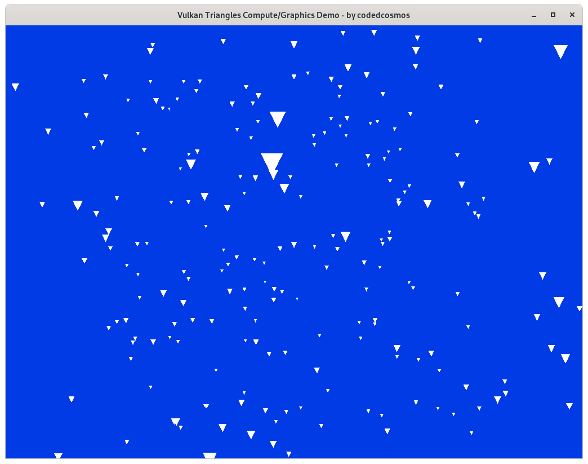

# Vulkan Compute/Graphics Demo
### By codedcosmos

It is just simple example that uses compute on the gpu to generate triangles and creates a model to render to the screen using the vulkan api.
The code quality likely won't be great since the purpose of developing this was a learning experience.
I'm simply uploading it as there aren't enough java examples for vulkan on the internet currently.

If you are using it as a reference do just note, some of this is suboptimal.

* GPLv3
* Graphics and compute
* Resizable swapchain/window

## Screenshot

